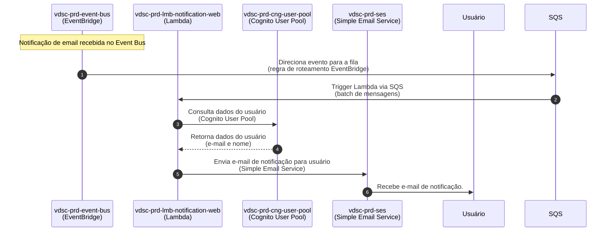
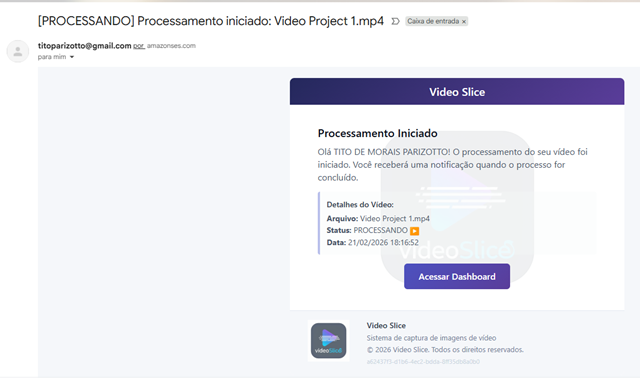
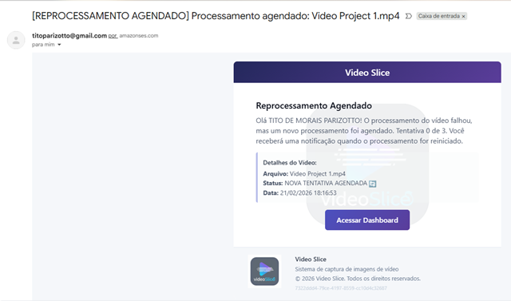
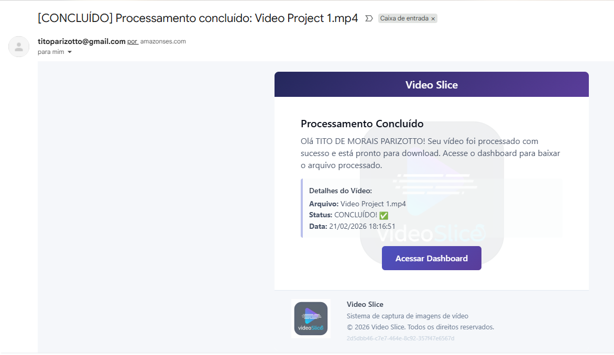
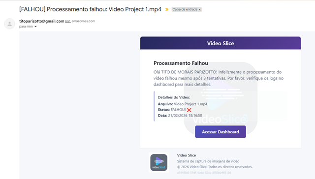

# MS Notification Email

[](https://github.com/11soat-hackathon-videoslice/ms-notification-email/actions/workflows/build_test_deploy_lambda.yaml)
[](https://sonarcloud.io/summary/new_code?id=11soat-hackton-videoslice_ms-notification-email)

Microserviço AWS Lambda para processamento de notificações por e-mail.

## Índice

- [Visão Geral](#-visão-geral)
- [Funcionalidades](#funcionalidades)
- [Arquitetura](#-arquitetura)
- [Fluxo de Execução](#fluxo-de-execução)
- [Diagrama de Sequência — Notificação Web Real-time para Usuário](#diagrama-de-sequência--notificação-web-real-time-para-usuário)
- [Exemplos de Notificações por E-mail](#-exemplos-de-notificações-por-e-mail)
- [Tecnologias](#-tecnologias)
- [Dependências](#-dependências)
- [Configuração](#-configuração)
- [Estrutura de Mensagens](#-estrutura-de-mensagens)
- [Testes](#-testes)
- [Deploy](#-deploy)
- [Integração](#-integração)
- [Permissões IAM](#-permissões-iam)

## 📋 Visão Geral

O **ms-notification-email** é um microserviço serverless implementado como AWS Lambda Function que processa notificações por e-mail do sistema VideoSlice. 
Este serviço consome mensagens de uma fila SQS contendo notificações de eventos do sistemae envia e-mails formatados para os usuários.

### Funcionalidades

- **Processamento de Notificações**: Consome mensagens da fila SQS com notificações
- **Validação de Canal**: Valida se a notificação contém canal EMAIL e conteúdo de e-mail
- **Envio de E-mails**: Envia e-mails formatados usando templates configurados
- **Integração com Core**: Utiliza a biblioteca video-slice-core para lógica de negócio
- **Processamento em Lote**: Processa múltiplos registros de uma única vez

## 🏗️ Arquitetura

O microserviço segue os princípios da **Clean Architecture**, utilizando a biblioteca core [video-slice-core](https://github.com/11soat-hackathon-videoslice/video-slice-core) para implementação das camadas de domínio e aplicação.

### Fluxo de Execução

1. **EventBridge** captura eventos de notificação do sistema
2. **SQS Queue** armazena as mensagens de notificação
3. **Lambda Function** é trigada pela fila SQS
4. **NotificationController** (da biblioteca core) processa a notificação
5. **EmailNotificationProducer** envia o e-mail via Amazon SES
6. **Response** retorna status de processamento

Diagrama de Sequência — Notificação Web Real-time para Usuário



### 📧 Exemplos de Notificações por E-mail

Os e-mails enviados seguem templates visuais de acordo com o status do processamento do vídeo:

#### 🔄 Processando
> Enviado quando o vídeo começa a ser processado pelo sistema.



---

#### 🔁 Retentativa Agendada
> Enviado quando o processamento falhou temporariamente e uma nova tentativa foi agendada.



---

#### ✅ Concluído
> Enviado quando o vídeo foi processado com sucesso e os arquivos estão disponíveis para download.



---

#### ❌ Falhou
> Enviado quando o processamento falhou definitivamente após todas as tentativas.



---

## 🚀 Tecnologias

- **Python 3.12**: Linguagem de programação
- **AWS Lambda**: Plataforma serverless
- **AWS SQS**: Fila de mensagens
- **AWS SES**: Serviço de envio de e-mails
- **AWS EventBridge**: Barramento de eventos
- **Boto3**: SDK AWS para Python
- **video-slice-core**: Biblioteca core com domínio e casos de uso

## 📦 Dependências

### Dependências de Produção
- `boto3`: SDK AWS para Python
- `requests`: Cliente HTTP
- `requests-aws4auth`: Autenticação AWS Signature V4
- `vdsc-core`: Biblioteca core com lógica de negócio

### Dependências de Desenvolvimento
- `pytest`: Framework de testes
- `pytest-cov`: Cobertura de testes
- `pytest-mock`: Mock para testes
- `pytest-asyncio`: Suporte a testes assíncronos
- `moto`: Mock de serviços AWS

## 🔧 Configuração

### Variáveis de Ambiente

A Lambda Function requer as seguintes variáveis de ambiente:

| Variável | Descrição | Exemplo |
|----------|-----------|---------|
| `AWS_REGION` | Região AWS (configurada automaticamente) | `us-east-1` |
| `SES_SOURCE_EMAIL` | E-mail remetente verificado no SES | `noreply@videoslice.com` |
| `SES_CONFIGURATION_SET` | Nome do configuration set do SES | `video-slice-emails` |

**Nota**: As variáveis `AWS_REGION` e `PYTHON_VERSION` são configuradas automaticamente pela AWS e não devem ser incluídas na configuração da Lambda.

## 📨 Estrutura de Mensagens

### Evento SQS de Entrada

```json
{
  "Records": [
    {
      "messageId": "b22abd8b-bc65-49ac-ac27-35cb0c8f4e25",
      "body": "{\"detail\":{\"channels\":[\"EMAIL\",\"WEB\"],\"content\":[{\"email\":{\"template\":\"PROCESSING\",\"user_id\":\"848834a8-20e1-7004-ee3b-4ba1495239d8\"}}],\"id\":\"79cdb25a-2d73-33b8-a2a2-e67db110961a\",\"metadata\":{\"videoId\":\"mkvltfiozmaT\",\"fileName\":\"Video Project 1\",\"status\":\"UPLOADED\"}}}",
      "eventSource": "aws:sqs",
      "eventSourceARN": "arn:aws:sqs:us-east-1:080145351546:vdsc-prd-sqs-notification-email"
    }
  ]
}
```

### Resposta de Sucesso (202)
```json
{
  "statusCode": 202,
  "body": "{\"status\": \"Recebido 1 evento(s) para processamento.\"}"
}
```

### Resposta de Erro (500)
```json
{
  "statusCode": 500,
  "body": "{\"error\": \"Erro ao processar notificação: [detalhes do erro]\"}"
}
```

## 🧪 Testes

### Executar Testes Unitários

```bash
cd "C:\Users\A0157633\dev\java\f5\ms-notification-email"
pytest tests/unit/ --cov=src/core --cov-report=xml:coverage.xml --cov-report=html --cov-report=term --junitxml=test-results.xml -v --cov-fail-under=80
```

**Nota**: Os arquivos de configuração `pytest.ini` e `conftest.py` estão localizados dentro do diretório `tests/`.

### Cobertura de Testes

O projeto mantém cobertura mínima de **80%** dos testes unitários, validada automaticamente na pipeline de CI/CD.

### Análise de Qualidade

```bash
pysonar --sonar-token=<seu-token>
```

A análise de qualidade é realizada automaticamente pelo SonarCloud a cada push/PR.

## 🚀 Deploy

### Pipeline CI/CD

O deploy é automatizado através do GitHub Actions. A pipeline executa:

1. **Testes Unitários**: Execução de todos os testes com cobertura mínima de 80%
2. **Quality Gate**: Validação de qualidade de código no SonarCloud
3. **Build**: Empacotamento da Lambda Function com dependências
4. **Deploy**: Deploy automático na AWS Lambda

### Deploy Manual

Para executar deploy manual:

```bash
# Via GitHub Actions
# 1. Acesse a aba "Actions" no repositório
# 2. Selecione "Build, Test and Deploy vdsc-prd-lmb-notification-email"
# 3. Clique em "Run workflow"
# 4. Configure "deploy_only" como true para pular os testes
```

### Logs

Os logs da Lambda Function estão disponíveis no CloudWatch Logs:
- Grupo: `/aws/lambda/vdsc-prd-lmb-notification-email`
- Região: `us-east-1`


## 🔗 Integração

### Trigger
- **SQS Queue**: `vdsc-prd-sqs-notification-email`
- **Batch Size**: Configurável (padrão: 10)
- **Visibility Timeout**: 300 segundos

### Recursos Relacionados
- **EventBridge**: Captura eventos de notificação do sistema
- **SES**: Envia e-mails formatados
- **CloudWatch Logs**: Armazena logs de execução

## 🔐 Permissões IAM

A Lambda Function requer as seguintes permissões:

- `sqs:ReceiveMessage`
- `sqs:DeleteMessage`
- `sqs:GetQueueAttributes`
- `ses:SendEmail`
- `ses:SendRawEmail`
- `logs:CreateLogGroup`
- `logs:CreateLogStream`
- `logs:PutLogEvents`

**Versão**: 1.0.0  
**Região AWS**: us-east-1  
**Runtime**: Python 3.12
